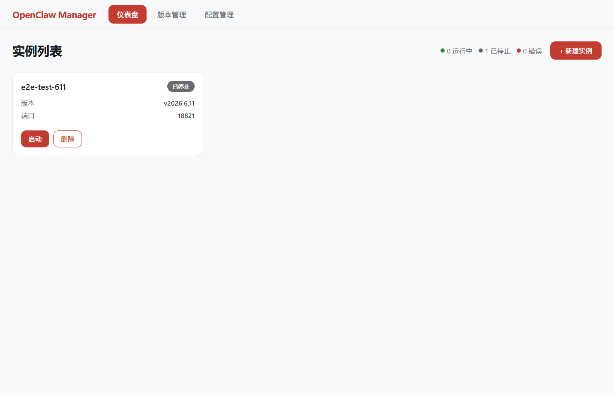
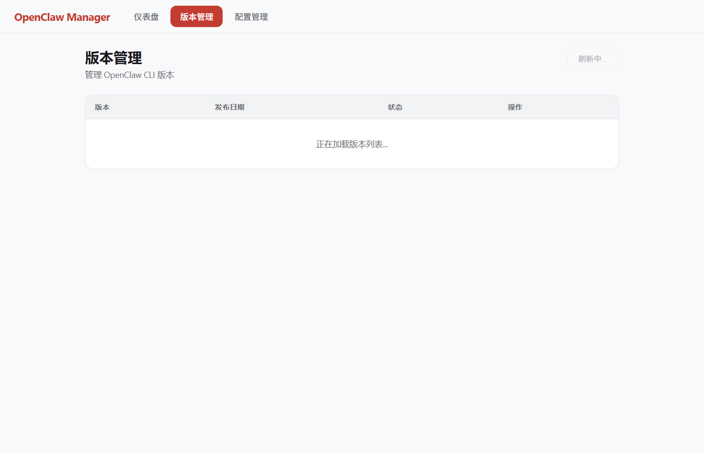
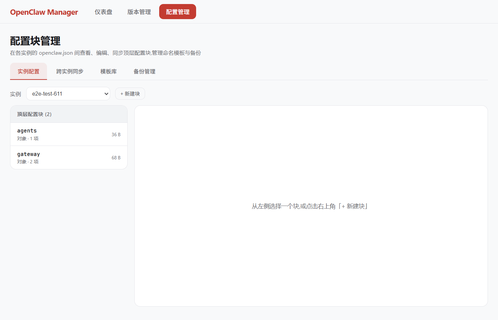
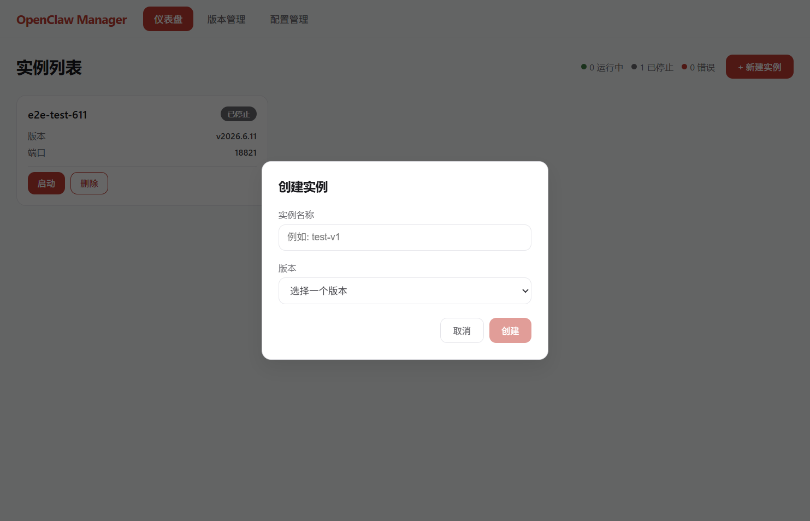

# OpenClaw Manager

> **📥 [下载 OpenClaw Manager 0.1.0](https://modelscope.cn/models/me9rez/code-lab/resolve/master/code-lab/openclaw-manager/OpenClaw%20Manager-0.1.0.7z)**
>
> [ModelScope](https://modelscope.cn/models/me9rez/code-lab) · [GitHub](https://github.com/me9rez/openclaw-manager)

基于 **Electron + Vue 3 + Pinia + TypeScript** 的桌面应用,用于在本地统一管理多个 [OpenClaw](https://www.npmjs.com/package/openclaw) CLI 实例。

支持 OpenClaw 多版本并行管理、实例生命周期控制、Web UI 一键打开、实时日志,以及 `openclaw.json` 配置块的查看、编辑、跨实例同步、命名模板与备份。

## 截图

> 截图由 `e2e/screenshots.spec.ts` 通过 Playwright + Electron 启动已构建的应用自动生成,可通过 `npm run test:e2e e2e/screenshots.spec.ts` 重新生成。

| 仪表盘 | 版本管理 |
| :---: | :---: |
|  |  |

| 配置管理 | 新建实例 |
| :---: | :---: |
|  |  |

## 功能特性

- **多版本管理**:从 npm registry 拉取可用版本,可一键安装 / 卸载,已安装列表与可用版本合并展示
- **实例生命周期**:创建实例并绑定已安装的 OpenClaw 版本,启动 / 停止 / 重启 / 删除全部走 IPC,主进程负责子进程监管
- **实时日志**:每个实例的子进程 stdout / stderr 流式缓冲,通过 `EventEmitter` 转发到渲染层,详情页以 `LogViewer` 实时滚动展示
- **健康检查**:启动后通过 WebSocket 与 OpenClaw gateway 通信,暴露 `version` / `uptime` 等健康信息
- **Web UI 打开**:在系统默认浏览器中打开 `http://127.0.0.1:<port>`
- **配置块管理**:在每个实例的 `openclaw.json` 中查看 / 编辑 / 新建顶层配置块,支持跨实例同步、命名模板、备份与还原
- **系统托盘**:关闭窗口隐藏到托盘,托盘菜单可显示当前实例并快速定位

## 快速开始

### 环境要求

- Node.js(开发机可放在 `PATH`;生产打包使用随 `resources/node/` 附带的 Node)
- Windows / macOS / Linux(本仓库 `electron-builder.yml` 仅声明 Windows 目标)
- npm

### 安装依赖

```bash
npm install
```

### 开发模式

```bash
npm run dev
```

`vite-plugin-electron` 会同时编译主进程与 preload 并启动 Electron,渲染层通过 Vite HMR 实时刷新。

### 类型检查

```bash
npm run typecheck
```

## 构建与发布

### 构建应用

```bash
npm run build
```

产出 `dist/`(渲染层)与 `dist-electron/main.js` / `dist-electron/preload.js`。

### 打包安装包

```bash
npm run build:installer
```

顺序:下载 Node 便携版(`setup:node`) → Vite 构建(`build`) → electron-builder 打包,产出 `release/OpenClaw Manager-0.1.0.7z`。

### 一行:打包 → 上传

```bash
export MY_MODEL_SCOPE_TOKEN=<token>
npm run release:all
```

自动执行:下载 Node → 构建 → 打包为 7z → 上传到 ModelScope `me9rez/code-lab/code-lab/openclaw-manager/`。

## E2E 测试

> **先构建再跑 E2E**。Playwright 通过 `_electron.launch({ args: ['dist-electron/main.js'] })` 启动的是已构建的 Electron。

### 冒烟用例(自包含)

```bash
npm run build && npm run test:e2e e2e/app.spec.ts
```

无需网络或文件系统前置状态。

### 端到端生命周期用例

需要真实可启动的 OpenClaw 进程:

```bash
npm run build
npm run setup:node
node scripts/ensure-version.cjs
npm run test:e2e e2e/instance.spec.ts
```

用例会创建名为 `e2e-test-611` 的实例并轮询最多 40 秒等待 `running` / `error` / `crashed`。

### 重新生成 README 截图

```bash
npm run build && npm run test:e2e e2e/screenshots.spec.ts
```

输出到 `docs/screenshots/01-dashboard.png` ... `04-create-modal.png`。

## 运行时数据布局

| 用途 | 路径 |
|---|---|
| 配置(实例列表、版本列表、`nextPort`) | `app.getPath("userData")/manager-config.json` |
| 实例状态目录(`openclaw.json` 等) | `~/.openclaw-manager/instances/<name>/` |
| 已安装的 OpenClaw 版本 | `~/.openclaw-manager/versions/<version>/` |
| 打包时附带的 Node.js + npm | `resources/node/`(由 `npm run setup:node` 填充,`.gitignore` 已排除,勿手动提交) |

Node 二进制解析顺序(`version-manager.resolveNodeBinary`):

1. `PATH` 上的 `node` / `node.exe`
2. 常见安装路径(`C:\Program Files\nodejs\node.exe`、`%LOCALAPPDATA%\Programs\nodejs\node.exe`、`/usr/local/bin/node` 等)
3. 打包目录:`process.resourcesPath/resources/node/node.exe`(生产)或 `resources/node/node.exe`(开发)
4. 全部失败 → `throw`

npm 二进制解析:从 resolved Node 所在目录派生 `npm.cmd`(Windows) / `npm`(Unix/macOS)。`installVersion` 用 `execFile` 调用,Windows 上设 `shell: true` 以支持 `.cmd` 文件。

## 常用命令速查

| 命令 | 作用 |
|---|---|
| `npm run dev` | Vite + Electron 开发模式(主进程 HMR) |
| `npm run build` | 构建渲染层与主进程(`dist/` + `dist-electron/`) |
| `npm run typecheck` | `vue-tsc --noEmit` |
| `npm run setup:node` | 下载 Node.js 便携版到 `resources/node/` |
| `npm run build:installer` | `setup:node` → `build` → electron-builder(产出 `.7z`) |
| `npm run release:all` | `build:installer` → 上传到 ModelScope |
| `npm run test:e2e` | Playwright E2E(headless) |
| `npm run test:e2e:headed` | Playwright E2E(可见窗口) |
| `node scripts/ensure-version.cjs` | 按需安装 `openclaw@2026.6.11` 至 `~/.openclaw-manager/versions/` |

## 架构

核心设计:

- 渲染层与主进程通信只能通过 `window.api`(preload 桥)
- 事件流通过 `EventEmitter` + `webContents.send` 推送给渲染层,组件在 `onMounted` 订阅、`onUnmounted` 清理
- 渲染层安全:`nodeIntegration: false`、`contextIsolation: true`、`sandbox: false`
- 路径别名 `@/*` → `src/*`,Vite + TS 均生效
- UI 文案全部为 zh-CN 硬编码,无 i18n 层
- 无 lint / 无格式化 / 无单元测试,沿用文件已有风格

## 许可证

[MIT](LICENSE) © 2026 me9rez
